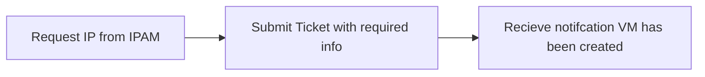

### VM Creation Process

### Basis of ticket
1. Name of VM or OVA: Text box IE Indy-NAME or SB-NAME
2. What would you like to deploy OVA or VM? : Radio Button
3. IP Obtained from IPAM: TEXT BOX REQUIRED Verification?
4. Pick a location where VM will Live (Datacenter) : Radio Button
    - Indy OR South Bend
5. Pick a location where VM will Live (Folder) : Drop Down
    - Akcelerant
    - Archive_Don't_Delete
    - Automation
    - Cisco
    - Citrix
    - Citrix/6.5
    - Citrix/6.5/Desktop
    - Citrix/6.5/Desktop/DT
    - Citrix/7.X
    - Citrix/7.X/App
    - Citrix/7.X/App/DNAApp
    - Citrix/7.X/App/ITAPP
    - Citrix/7.X/App/LoanApp
    - Citrix/7.X/App/LoanApp/Prod
    - Citrix/7.X/App/LoanApp/Test
    - Citrix/7.X/App/Test
    - Citrix/7.X/DT
    - Citrix/7.X/DT/PackagingVMs
    - Citrix/7.X/DT/TemplateVMs
    - Citrix/7.X/Other
    - Citrix/ADC
    - Citrix/ADC/External%2fDMZ
    - Citrix/ADC/Internal
    - Citrix/ADM
    - Citrix/Cloud Connectors
    - Citrix/Provisioning Services
    - Citrix/ShareFile Controllers
    - Citrix/StoreFront
    - Citrix/XenMobile
    - Collaboration
    - EG_Innovations_PoC
    - EMC
    - Finastra
    - Fiserv
    - IGEL
    - Jump Boxes
    - Manage_Engine
    - OpenText
    - Prologue
    - Security
    - Security/Ivanti
    - Shared Services
    - Shared Services/Domain Controllers
    - SolarWinds
    - Splunk
    - SQL
    - Suntell
    - Templates
    - Test
    - tMagic
    - ToolCase
    - Veeam
    - VMware

    - Backup Replication
    - Cisco
    - Citrix
    - Citrix/ADC
    - Citrix/App
    - Citrix/App/DNA
    - Citrix/App/Loan
    - Citrix/App/Loan/Prod
    - Citrix/App/Loan/Test
    - Citrix/App/PROD
    - Citrix/App/PROD/2008 R2
    - Citrix/App/PROD/2012
    - Citrix/App/PROD/2016
    - Citrix/App/Test
    - Citrix/App/Win10
    - Citrix/Desktop
    - Citrix/Desktop/Prod
    - Citrix/Desktop/Test
    - Citrix/Desktop/Training
    - Domain Controllers
    - EMC
    - Finastra
    - Fiserv
    - SB-SQL
    - SDP
    - Security
    - Shared Services
    - Splunk
    - Templates
    - tMagic
    - ToolCase
    - Varonis
    - VMware

6. Which Datastore?
   - Clustered
   - Recover Point

7. Application Owner: Text Box

8.  Machine Owner: Drop Down
    - David Prows
    - Devan Tilly
    - Ethan Purdy
    - Jason Hassett
    - Jeremy Becker
    - Justin Brant
    - Michael Werling
    - Natasha McKinley
    - Shaylan King

9. Status Tag: Drop Down
    - Development
    - Non-Production
    - Production
    - Replica
    - Test
    - Training

### Steps for VM Creation
10. Pick Spec for VM (Should have pre-defined builds) 
    - CPU: Drop Down
        - 1
        - 2
        - 4
        - 8
        - 16
    - MEM: TextBox Limited?
    - HDD: TextBox Limited? 

11. Determine OS (Windows Server, Windows 10, Cent OS 7, Cent OS 8): Drop Down
    - Windows Server 2016
    - Windows Server 2019
    - Windows 10
    - Cent OS
12. Determine RTO (This should also set our backup standard): Drop Down

- Submit Ticket

### Steps for OVA Creation
10. Download location or network location of OVA

11. Determine RTO (This should also set our backup standard): Drop Down

- Submit Ticket
